# Project Diagrams - Sales CRM

## CRM Healthcare/Pharmaceutical Platform

**Versi**: 1.2  
**Last Updated**: 2025-01-20  
**Purpose**: Visualisasi scope, fitur, dan user flow untuk Developer 1, 2, dan 3

---

## 📋 Daftar Isi

1. [Project Scope Overview](#project-scope-overview)
2. [Feature Modules Diagram](#feature-modules-diagram)
3. [User Flow Diagrams](#user-flow-diagrams)
4. [Input/Output Diagrams](#inputoutput-diagrams)
5. [System Architecture Diagram](#system-architecture-diagram)
6. [Core ERD Diagram](#core-erd-diagram)

---

## Project Scope Overview

### Platform & Technology Stack

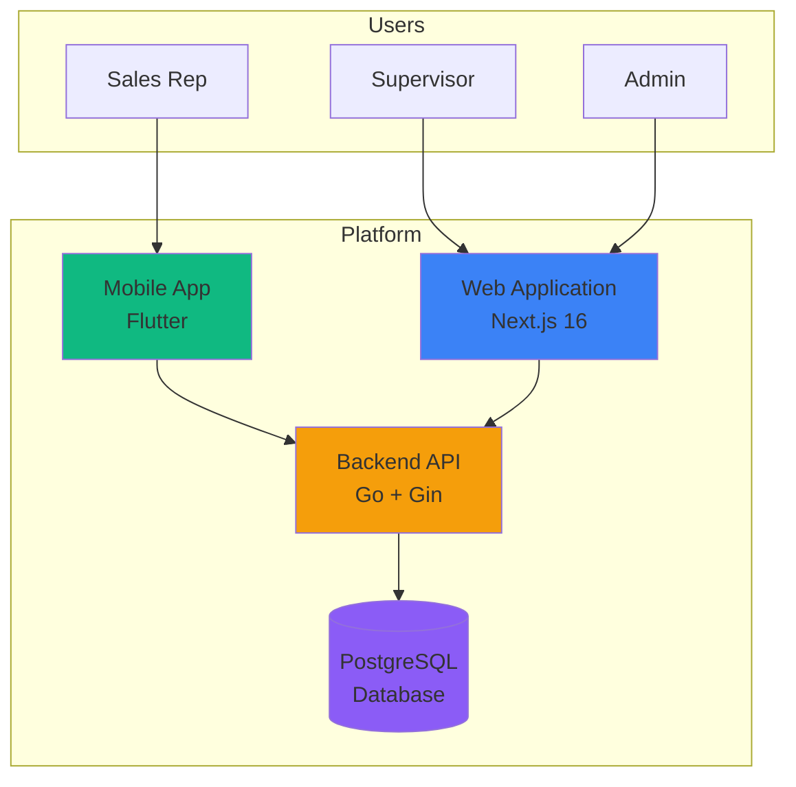
```mermaid
graph TB
    subgraph "Platform"
        WEB[Web Application<br/>Next.js 16]
        MOBILE[Mobile App<br/>Flutter]
        BACKEND[Backend API<br/>Go + Gin]
        DB[(PostgreSQL<br/>Database)]
    end

    subgraph "Users"
        SALES[Sales Rep]
        SUPERVISOR[Supervisor]
        ADMIN[Admin]
    end

    SALES --> MOBILE
    SUPERVISOR --> WEB
    ADMIN --> WEB

    MOBILE --> BACKEND
    WEB --> BACKEND
    BACKEND --> DB

    style WEB fill:#3b82f6
    style MOBILE fill:#10b981
    style BACKEND fill:#f59e0b
    style DB fill:#8b5cf6
```

### Core Modules Overview

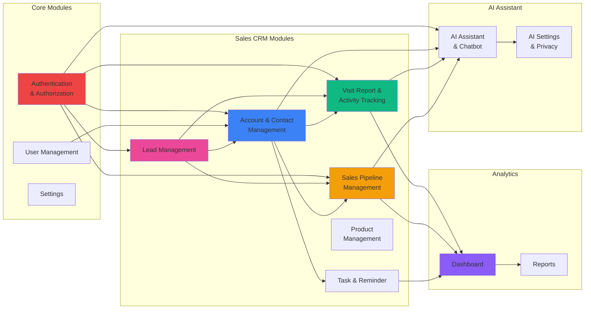
```mermaid
graph LR
    subgraph "Core Modules"
        AUTH[Authentication<br/>& Authorization]
        USER[User Management]
        SETTINGS[Settings]
    end

    subgraph "Sales CRM Modules"
        LEAD[Lead Management]
        ACCOUNT[Account & Contact<br/>Management]
        VISIT[Visit Report &<br/>Activity Tracking]
        PIPELINE[Sales Pipeline<br/>Management]
        TASK[Task & Reminder]
        PRODUCT[Product<br/>Management]
    end

    subgraph "Analytics"
        DASHBOARD[Dashboard]
        REPORTS[Reports]
    end

    subgraph "AI Assistant"
        AI[AI Assistant<br/>& Chatbot]
        AI_SETTINGS[AI Settings<br/>& Privacy]
    end

    AUTH --> LEAD
    AUTH --> ACCOUNT
    AUTH --> VISIT
    AUTH --> PIPELINE
    AUTH --> AI
    USER --> ACCOUNT
    LEAD --> ACCOUNT
    LEAD --> VISIT
    LEAD --> PIPELINE
    ACCOUNT --> VISIT
    ACCOUNT --> PIPELINE
    ACCOUNT --> TASK
    ACCOUNT --> AI
    VISIT --> DASHBOARD
    VISIT --> AI
    PIPELINE --> DASHBOARD
    PIPELINE --> AI
    TASK --> DASHBOARD
    DASHBOARD --> REPORTS
    AI --> AI_SETTINGS

    style AUTH fill:#ef4444
    style LEAD fill:#ec4899
    style ACCOUNT fill:#3b82f6
    style VISIT fill:#10b981
    style PIPELINE fill:#f59e0b
    style DASHBOARD fill:#8b5cf6
```

---

## Core ERD Diagram

### Repo-Synced ERD Inti Traciio CRM

Diagram berikut disusun berdasarkan entity dan migration yang aktif di backend `apps/api/internal/domain/*` serta migration pada `apps/api/internal/database/migrations`. Diagram ini fokus pada **entitas inti CRM dan kontrol akses** yang paling relevan untuk skripsi dan dokumentasi teknis, sehingga tabel utilitas seperti token, notification, reminder, AI settings, dan area mapping tidak dimasukkan di sini.


```mermaid
erDiagram
    USERS {
        uuid id PK
        uuid role_id FK
        uuid group_id FK
        uuid brick_id FK
        string email
        string password
        string name
        string avatar_url
        string status
        datetime created_at
        datetime updated_at
        datetime deleted_at
    }

    ROLES {
        uuid id PK
        string name
        string code
        string description
        string status
        boolean mobile_access
        boolean is_protected
        datetime created_at
        datetime updated_at
        datetime deleted_at
    }

    PERMISSIONS {
        uuid id PK
        uuid menu_id FK
        string name
        string code
        string description
        string resource
        string action
        datetime created_at
        datetime updated_at
        datetime deleted_at
    }

    MENUS {
        uuid id PK
        uuid parent_id FK
        string name
        string icon
        string url
        int order
        string status
        datetime created_at
        datetime updated_at
        datetime deleted_at
    }

    ROLE_PERMISSIONS {
        uuid role_id PK,FK
        uuid permission_id PK,FK
    }

    ROLE_SCOPES {
        uuid id PK
        uuid role_id FK
        string resource
        string scope
        datetime created_at
        datetime updated_at
    }

    GROUPS {
        uuid id PK
        string name
        string code
        string description
        string status
        datetime created_at
        datetime updated_at
        datetime deleted_at
    }

    BRICKS {
        uuid id PK
        uuid manager_id FK
        string name
        string code
        string description
        string province
        string regency
        string district
        string status
        datetime created_at
        datetime updated_at
        datetime deleted_at
    }

    CATEGORIES {
        uuid id PK
        string name
        string code
        string description
        string badge_color
        string status
        datetime created_at
        datetime updated_at
    }

    ACCOUNTS {
        uuid id PK
        uuid category_id FK
        uuid assigned_to FK
        uuid brick_id FK
        string name
        string address
        string city
        string province
        string phone
        string email
        decimal latitude
        decimal longitude
        string postal_code
        string country
        string website
        string industry
        string status
        datetime created_at
        datetime updated_at
        datetime deleted_at
    }

    CONTACT_ROLES {
        uuid id PK
        string name
        string code
        string description
        string badge_color
        string status
        datetime created_at
        datetime updated_at
    }

    CONTACTS {
        uuid id PK
        uuid account_id FK
        uuid role_id FK
        string name
        string phone
        string email
        string position
        string notes
        datetime created_at
        datetime updated_at
        datetime deleted_at
    }

    LEAD_STATUSES {
        uuid id PK
        string name
        string code
        string description
        int score
        string color
        int order
        boolean is_active
        boolean is_default
        boolean is_converted
        uuid created_by
        datetime created_at
        datetime updated_at
        datetime deleted_at
    }

    LEADS {
        uuid id PK
        uuid lead_status_id FK
        uuid assigned_to FK
        uuid account_id FK
        uuid contact_id FK
        uuid opportunity_id FK
        uuid converted_pipeline_id FK
        uuid converted_by FK
        string first_name
        string last_name
        string company_name
        string email
        string phone
        string job_title
        string industry
        string lead_source
        string lead_status
        int lead_score
        int probability
        bigint estimated_value
        boolean budget_confirmed
        bigint budget_amount
        boolean authority_confirmed
        string authority_person
        boolean need_confirmed
        string need_description
        boolean timeline_confirmed
        date expected_close_date
        json conversion_metadata
        string address
        string city
        string province
        string postal_code
        string country
        decimal latitude
        decimal longitude
        string website
        uuid created_by
        datetime converted_at
        datetime created_at
        datetime updated_at
        datetime deleted_at
    }

    LEAD_QUALIFICATION_CHECKLIST {
        uuid id PK
        uuid lead_id FK
        bigint budget_target_amount
        string budget_target_currency
        boolean budget_confirmed
        string budget_notes
        string authority_target_person
        string authority_target_role
        boolean authority_confirmed
        string authority_notes
        json need_target_products
        string need_priority_level
        boolean need_confirmed
        string need_notes
        date timeline_target_date
        string timeline_flexibility
        boolean timeline_confirmed
        string timeline_notes
        int qualification_score
        string qualification_status
        datetime created_at
        datetime updated_at
    }

    PIPELINE_STAGES {
        uuid id PK
        string name
        string code
        int order
        string color
        boolean is_active
        boolean is_won
        boolean is_lost
        int probability
        string description
        datetime created_at
        datetime updated_at
        datetime deleted_at
    }

    DEALS {
        uuid id PK
        uuid account_id FK
        uuid contact_id FK
        uuid stage_id FK
        uuid assigned_to FK
        uuid lead_id FK
        uuid brick_id FK
        uuid created_by FK
        string title
        string description
        bigint value
        int probability
        date expected_close_date
        date actual_close_date
        string status
        string source
        boolean budget_confirmed
        boolean authority_confirmed
        boolean need_confirmed
        boolean timeline_confirmed
        json qualification_snapshot
        string close_reason
        string notes
        datetime created_at
        datetime updated_at
        datetime deleted_at
    }

    DEAL_HISTORIES {
        uuid id PK
        uuid deal_id FK
        uuid from_stage_id FK
        uuid to_stage_id FK
        uuid changed_by FK
        string from_stage_name
        string to_stage_name
        int from_probability
        int to_probability
        int days_in_prev_stage
        datetime changed_at
        string reason
        string notes
        datetime created_at
        datetime updated_at
        datetime deleted_at
    }

    PRODUCT_CATEGORIES {
        uuid id PK
        string name
        string slug
        string description
        string status
        datetime created_at
        datetime updated_at
    }

    PRODUCTS {
        uuid id PK
        uuid category_id FK
        string name
        string sku
        string barcode
        bigint price
        bigint cost
        string description
        string status
        string image_url
        datetime created_at
        datetime updated_at
        datetime deleted_at
    }

    DEAL_PRODUCT_ITEMS {
        uuid id PK
        uuid deal_id FK
        uuid product_id FK
        uuid product_category_id FK
        string product_name
        string product_sku
        bigint unit_price
        bigint unit_cost
        int quantity
        bigint discount_amount
        bigint subtotal
        string product_category_name
        bigint margin_amount
        float margin_percentage
        string notes
        datetime created_at
        datetime updated_at
        datetime deleted_at
    }

    ACTIVITY_TYPES {
        uuid id PK
        string name
        string code
        string description
        string icon
        string badge_color
        string status
        int order
        datetime created_at
        datetime updated_at
        datetime deleted_at
    }

    ACTIVITIES {
        uuid id PK
        uuid activity_type_id FK
        uuid account_id FK
        uuid contact_id FK
        uuid deal_id FK
        uuid lead_id FK
        uuid user_id FK
        string type
        string description
        datetime timestamp
        json metadata
        datetime created_at
        datetime updated_at
        datetime deleted_at
    }

    TASKS {
        uuid id PK
        uuid assigned_to FK
        uuid assigned_from FK
        uuid account_id FK
        uuid contact_id FK
        uuid deal_id FK
        uuid lead_id FK
        uuid created_by FK
        string title
        string description
        string type
        string status
        string priority
        datetime due_date
        datetime completed_at
        string task_source
        datetime scheduled_start_time
        datetime scheduled_end_time
        string scheduled_location
        boolean is_schedule_task
        string quick_action_type
        json quick_action_payload
        string google_calendar_event_id
        string google_calendar_sync_status
        datetime google_calendar_synced_at
        datetime created_at
        datetime updated_at
        datetime deleted_at
    }

    VISIT_REPORTS {
        uuid id PK
        uuid account_id FK
        uuid contact_id FK
        uuid deal_id FK
        uuid lead_id FK
        uuid sales_rep_id FK
        uuid brick_id FK
        uuid approved_by FK
        datetime visit_date
        datetime check_in_time
        datetime check_out_time
        json check_in_location
        json check_out_location
        string purpose
        string notes
        string outcome
        string next_steps
        json photos
        json metadata
        string status
        datetime approved_at
        string rejection_reason
        datetime created_at
        datetime updated_at
        datetime deleted_at
    }

    MONTHLY_TARGETS {
        uuid id PK
        uuid group_id FK
        uuid user_id FK
        uuid brick_id FK
        int year
        int month
        bigint target_amount
        datetime created_at
        datetime updated_at
        datetime deleted_at
    }

    ROLES ||--o{ USERS : assigns
    GROUPS ||--o{ USERS : groups
    BRICKS ||--o{ USERS : covers
    ROLES ||--o{ ROLE_SCOPES : defines
    MENUS ||--o{ PERMISSIONS : groups
    MENUS ||--o{ MENUS : parent_child
    ROLES ||--o{ ROLE_PERMISSIONS : maps
    PERMISSIONS ||--o{ ROLE_PERMISSIONS : maps
    USERS ||--o{ BRICKS : manages

    CATEGORIES ||--o{ ACCOUNTS : categorizes
    USERS ||--o{ ACCOUNTS : assigned_to
    BRICKS ||--o{ ACCOUNTS : belongs_to
    ACCOUNTS ||--o{ CONTACTS : owns
    CONTACT_ROLES ||--o{ CONTACTS : classifies

    LEAD_STATUSES ||--o{ LEADS : classifies
    USERS ||--o{ LEADS : assigned_to
    USERS ||--o{ LEADS : created_by
    USERS ||--o{ LEADS : converted_by
    ACCOUNTS ||--o{ LEADS : converts_to
    CONTACTS ||--o{ LEADS : converts_to
    DEALS ||--o{ LEADS : opportunity_ref
    DEALS ||--o{ LEADS : converted_pipeline_ref
    LEADS ||--|| LEAD_QUALIFICATION_CHECKLIST : qualifies

    PIPELINE_STAGES ||--o{ DEALS : stages
    ACCOUNTS ||--o{ DEALS : owns
    CONTACTS ||--o{ DEALS : references
    USERS ||--o{ DEALS : assigned_to
    USERS ||--o{ DEALS : created_by
    LEADS ||--o{ DEALS : source_lead
    BRICKS ||--o{ DEALS : territory

    DEALS ||--o{ DEAL_HISTORIES : tracks
    PIPELINE_STAGES ||--o{ DEAL_HISTORIES : from_stage
    PIPELINE_STAGES ||--o{ DEAL_HISTORIES : to_stage
    USERS ||--o{ DEAL_HISTORIES : changed_by

    PRODUCT_CATEGORIES ||--o{ PRODUCTS : classifies
    DEALS ||--o{ DEAL_PRODUCT_ITEMS : contains
    PRODUCTS ||--o{ DEAL_PRODUCT_ITEMS : snapshots
    PRODUCT_CATEGORIES ||--o{ DEAL_PRODUCT_ITEMS : categorizes

    ACTIVITY_TYPES ||--o{ ACTIVITIES : classifies
    ACCOUNTS ||--o{ ACTIVITIES : context
    CONTACTS ||--o{ ACTIVITIES : context
    DEALS ||--o{ ACTIVITIES : context
    LEADS ||--o{ ACTIVITIES : context
    USERS ||--o{ ACTIVITIES : performs

    USERS ||--o{ TASKS : assigned_to
    USERS ||--o{ TASKS : assigned_from
    USERS ||--o{ TASKS : created_by
    ACCOUNTS ||--o{ TASKS : context
    CONTACTS ||--o{ TASKS : context
    DEALS ||--o{ TASKS : context
    LEADS ||--o{ TASKS : context

    ACCOUNTS ||--o{ VISIT_REPORTS : visits
    CONTACTS ||--o{ VISIT_REPORTS : visits
    DEALS ||--o{ VISIT_REPORTS : visits
    LEADS ||--o{ VISIT_REPORTS : visits
    USERS ||--o{ VISIT_REPORTS : sales_rep
    USERS ||--o{ VISIT_REPORTS : approved_by
    BRICKS ||--o{ VISIT_REPORTS : territory

    GROUPS ||--o{ MONTHLY_TARGETS : target_scope
    USERS ||--o{ MONTHLY_TARGETS : target_scope
    BRICKS ||--o{ MONTHLY_TARGETS : target_scope
```

### Keterangan Akademik

- `LEADS` adalah pintu masuk awal proses CRM, lalu dapat dikonversi menjadi `ACCOUNTS`, `CONTACTS`, dan `DEALS`.
- `DEALS` adalah inti pipeline penjualan dan diperkaya oleh `DEAL_PRODUCT_ITEMS`, `DEAL_HISTORIES`, `VISIT_REPORTS`, `ACTIVITIES`, dan `TASKS`.
- `VISIT_REPORTS`, `ACTIVITIES`, dan `TASKS` adalah tabel operasional yang membentuk jejak eksekusi sales harian.
- `ROLE_SCOPES` melengkapi RBAC dengan model visibilitas data `global/team/own`, sehingga penting untuk menjelaskan isolasi data pada skripsi.
- `MONTHLY_TARGETS` penting untuk fitur analytics, target achievement, dan performance dashboard.

### Catatan Sinkronisasi dengan Repo

- Diagram ini **sinkron dengan entity backend saat ini**, tetapi tetap disederhanakan pada level tipe data agar mudah dipakai di skripsi.
- Tabel utilitas/non-inti yang tidak ditampilkan: `google_calendar_tokens`, `notifications`, `refresh_tokens`, `reminders`, `ai_settings`, `area_captures`, `territories`, `coverage_analysis`, dan tabel teknis lain di luar inti CRM.
- Jika Anda membutuhkan versi untuk bab metodologi atau bab perancangan basis data, diagram ini bisa dipakai sebagai **ERD inti sistem**, sedangkan tabel utilitas dapat dipisahkan ke lampiran.

---

## Feature Modules Diagram

### Module Features & Capabilities

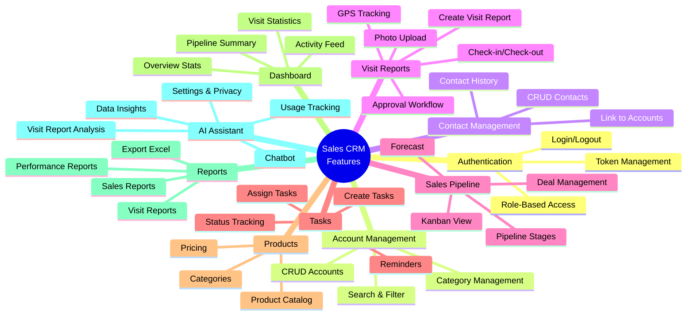
```mermaid
mindmap
  root((Sales CRM<br/>Features))
    Authentication
      Login/Logout
      Token Management
      Role-Based Access
    Account Management
      CRUD Accounts
      Search & Filter
      Category Management
    Contact Management
      CRUD Contacts
      Link to Accounts
      Contact History
    Visit Reports
      Create Visit Report
      Check-in/Check-out
      GPS Tracking
      Photo Upload
      Approval Workflow
    Sales Pipeline
      Pipeline Stages
      Deal Management
      Forecast
      Kanban View
    Tasks
      Create Tasks
      Assign Tasks
      Reminders
      Status Tracking
    Products
      Product Catalog
      Pricing
      Categories
    Dashboard
      Overview Stats
      Visit Statistics
      Pipeline Summary
      Activity Feed
    Reports
      Visit Reports
      Sales Reports
      Performance Reports
      Export Excel
    AI Assistant
      Chatbot
      Visit Report Analysis
      Data Insights
      Settings & Privacy
      Usage Tracking
```

### Feature Matrix by Platform & Role

| Feature                | Web (Admin)        | Web (Supervisor)       | Web (Sales Rep)     | Mobile (Sales Rep)  | Backend API |
| ---------------------- | ------------------ | ---------------------- | ------------------- | ------------------- | ----------- |
| **Authentication**     | ✅ Full            | ✅ Full                | ✅ Full             | ✅ Full             | ✅ Full     |
| **User Management**    | ✅ Full            | ❌                     | ❌                  | ❌                  | ✅ Full     |
| **Account Management** | ✅ Full (CRUD)     | ✅ Full (CRUD)         | ✅ Full (CRUD)      | ✅ View Only        | ✅ Full     |
| **Contact Management** | ✅ Full (CRUD)     | ✅ Full (CRUD)         | ✅ Full (CRUD)      | ✅ View Only        | ✅ Full     |
| **Visit Reports**      | ✅ Full (View All) | ✅ Review/Approve      | ✅ Create/View Own  | ✅ Create/View Own  | ✅ Full     |
| **Sales Pipeline**     | ✅ Full            | ✅ Full                | ✅ Full (Own Deals) | ❌                  | ✅ Full     |
| **Tasks**              | ✅ Full            | ✅ Full (Assign)       | ✅ Full (Own Tasks) | ✅ Full (Own Tasks) | ✅ Full     |
| **Products**           | ✅ Full            | ✅ View Only           | ✅ View Only        | ✅ View Only        | ✅ Full     |
| **Dashboard**          | ✅ Full (All Data) | ✅ Full (Team Data)    | ✅ Full (Own Data)  | ✅ Basic (Own Data) | ✅ Full     |
| **Reports**            | ✅ Full            | ✅ Full (Team Reports) | ✅ View Own Reports | ❌                  | ✅ Full     |

**Note**:

- Sales Rep dapat menggunakan **Web App** untuk semua fitur yang tersedia di Mobile, plus fitur tambahan seperti Sales Pipeline
- Mobile App fokus pada fitur yang dibutuhkan di lapangan (Visit Reports dengan GPS/Camera, Tasks, Dashboard basic)
- Web App memberikan akses lebih lengkap untuk Sales Rep, terutama untuk data entry dan review yang lebih nyaman

---

## User Flow Diagrams

### 1. Sales Rep User Flow (Web)

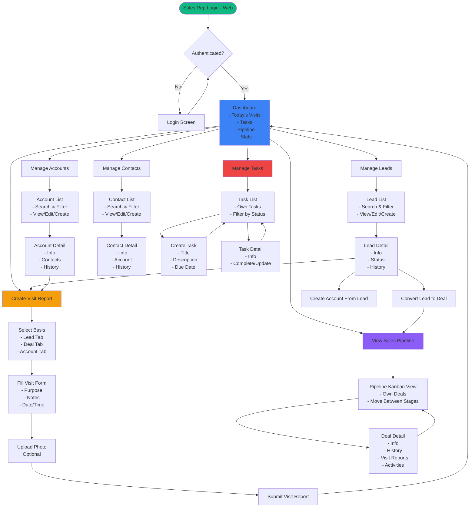
```mermaid
flowchart TD
    START([Sales Rep Login - Web]) --> AUTH{Authenticated?}
    AUTH -->|No| LOGIN[Login Screen]
    LOGIN --> AUTH
    AUTH -->|Yes| DASHBOARD[Dashboard<br/>- Today's Visits<br/>- Tasks<br/>- Pipeline<br/>- Stats]

    DASHBOARD --> MANAGE_LEADS[Manage Leads]
    DASHBOARD --> MANAGE_ACCOUNTS[Manage Accounts]
    DASHBOARD --> MANAGE_CONTACTS[Manage Contacts]
    DASHBOARD --> CREATE_VISIT[Create Visit Report]
    DASHBOARD --> VIEW_PIPELINE[View Sales Pipeline]
    DASHBOARD --> MANAGE_TASKS[Manage Tasks]

    MANAGE_LEADS --> LEAD_LIST[Lead List<br/>- Search & Filter<br/>- View/Edit/Create]
    LEAD_LIST --> LEAD_DETAIL[Lead Detail<br/>- Info<br/>- Status<br/>- History]
    LEAD_DETAIL --> CONVERT_LEAD[Convert Lead to Deal]
    LEAD_DETAIL --> CREATE_ACCOUNT[Create Account From Lead]
    LEAD_DETAIL --> CREATE_VISIT
    CONVERT_LEAD --> VIEW_PIPELINE

    MANAGE_ACCOUNTS --> ACCOUNT_LIST[Account List<br/>- Search & Filter<br/>- View/Edit/Create]
    ACCOUNT_LIST --> ACCOUNT_DETAIL[Account Detail<br/>- Info<br/>- Contacts<br/>- History]
    ACCOUNT_DETAIL --> CREATE_VISIT

    MANAGE_CONTACTS --> CONTACT_LIST[Contact List<br/>- Search & Filter<br/>- View/Edit/Create]
    CONTACT_LIST --> CONTACT_DETAIL[Contact Detail<br/>- Info<br/>- Account<br/>- History]

    CREATE_VISIT --> SELECT_BASIS[Select Basis<br/>- Lead Tab<br/>- Deal Tab<br/>- Account Tab]
    SELECT_BASIS --> FILL_FORM[Fill Visit Form<br/>- Purpose<br/>- Notes<br/>- Date/Time]
    FILL_FORM --> UPLOAD_PHOTO[Upload Photo<br/>Optional]
    UPLOAD_PHOTO --> SUBMIT[Submit Visit Report]
    SUBMIT --> DASHBOARD

    VIEW_PIPELINE --> PIPELINE_KANBAN[Pipeline Kanban View<br/>- Own Deals<br/>- Move Between Stages]
    PIPELINE_KANBAN --> DEAL_DETAIL[Deal Detail<br/>- Info<br/>- History<br/>- Visit Reports<br/>- Activities]
    DEAL_DETAIL --> PIPELINE_KANBAN

    MANAGE_TASKS --> TASK_LIST[Task List<br/>- Own Tasks<br/>- Filter by Status]
    TASK_LIST --> CREATE_TASK[Create Task<br/>- Title<br/>- Description<br/>- Due Date]
    TASK_LIST --> TASK_DETAIL[Task Detail<br/>- Info<br/>- Complete/Update]
    CREATE_TASK --> TASK_LIST
    TASK_DETAIL --> TASK_LIST

    style START fill:#10b981
    style DASHBOARD fill:#3b82f6
    style CREATE_VISIT fill:#f59e0b
    style VIEW_PIPELINE fill:#8b5cf6
    style MANAGE_TASKS fill:#ef4444
```

### 2. Sales Rep User Flow (Mobile)

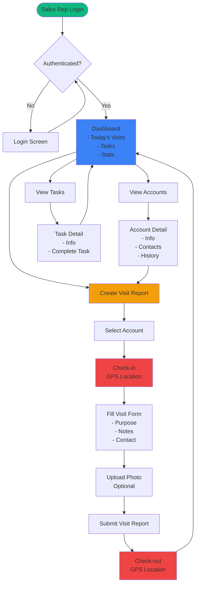
```mermaid
flowchart TD
    START([Sales Rep Login]) --> AUTH{Authenticated?}
    AUTH -->|No| LOGIN[Login Screen]
    LOGIN --> AUTH
    AUTH -->|Yes| DASHBOARD[Dashboard<br/>- Today's Visits<br/>- Tasks<br/>- Stats]

    DASHBOARD --> VIEW_ACCOUNTS[View Accounts]
    DASHBOARD --> VIEW_TASKS[View Tasks]
    DASHBOARD --> CREATE_VISIT[Create Visit Report]

    VIEW_ACCOUNTS --> ACCOUNT_DETAIL[Account Detail<br/>- Info<br/>- Contacts<br/>- History]
    ACCOUNT_DETAIL --> CREATE_VISIT

    VIEW_TASKS --> TASK_DETAIL[Task Detail<br/>- Info<br/>- Complete Task]
    TASK_DETAIL --> DASHBOARD

    CREATE_VISIT --> SELECT_ACCOUNT[Select Account]
    SELECT_ACCOUNT --> CHECK_IN[Check-in<br/>GPS Location]
    CHECK_IN --> FILL_FORM[Fill Visit Form<br/>- Purpose<br/>- Notes<br/>- Contact]
    FILL_FORM --> UPLOAD_PHOTO[Upload Photo<br/>Optional]
    UPLOAD_PHOTO --> SUBMIT[Submit Visit Report]
    SUBMIT --> CHECK_OUT[Check-out<br/>GPS Location]
    CHECK_OUT --> DASHBOARD

    style START fill:#10b981
    style DASHBOARD fill:#3b82f6
    style CREATE_VISIT fill:#f59e0b
    style CHECK_IN fill:#ef4444
    style CHECK_OUT fill:#ef4444
```

### 3. Supervisor User Flow (Web)

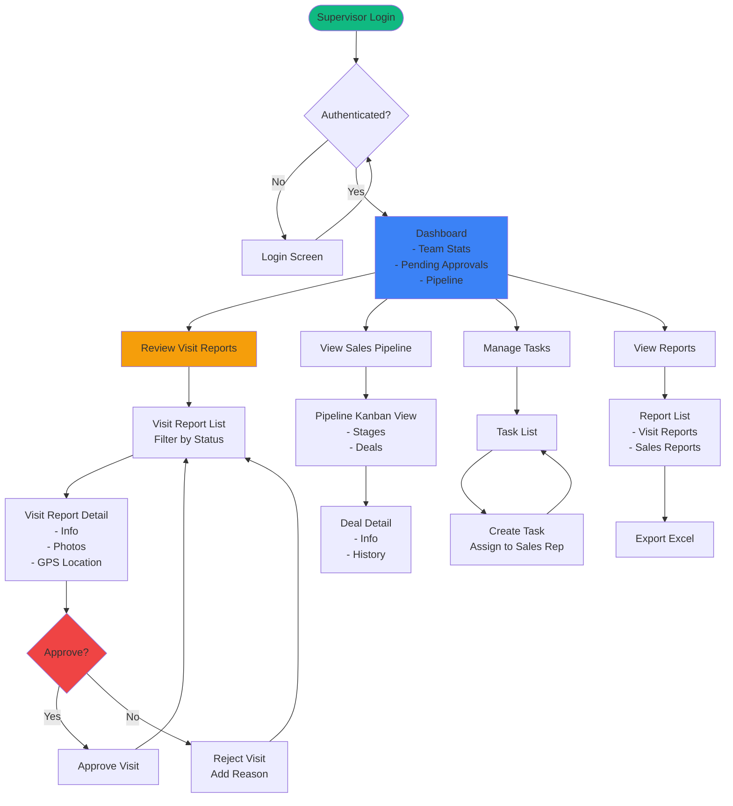
```mermaid
flowchart TD
    START([Supervisor Login]) --> AUTH{Authenticated?}
    AUTH -->|No| LOGIN[Login Screen]
    LOGIN --> AUTH
    AUTH -->|Yes| DASHBOARD[Dashboard<br/>- Team Stats<br/>- Pending Approvals<br/>- Pipeline]

    DASHBOARD --> REVIEW_VISITS[Review Visit Reports]
    DASHBOARD --> VIEW_PIPELINE[View Sales Pipeline]
    DASHBOARD --> MANAGE_TASKS[Manage Tasks]
    DASHBOARD --> VIEW_REPORTS[View Reports]

    REVIEW_VISITS --> VISIT_LIST[Visit Report List<br/>Filter by Status]
    VISIT_LIST --> VISIT_DETAIL[Visit Report Detail<br/>- Info<br/>- Photos<br/>- GPS Location]
    VISIT_DETAIL --> APPROVE{Approve?}
    APPROVE -->|Yes| APPROVE_ACTION[Approve Visit]
    APPROVE -->|No| REJECT_ACTION[Reject Visit<br/>Add Reason]
    APPROVE_ACTION --> VISIT_LIST
    REJECT_ACTION --> VISIT_LIST

    VIEW_PIPELINE --> PIPELINE_KANBAN[Pipeline Kanban View<br/>- Stages<br/>- Deals]
    PIPELINE_KANBAN --> DEAL_DETAIL[Deal Detail<br/>- Info<br/>- History]

    MANAGE_TASKS --> TASK_LIST[Task List]
    TASK_LIST --> CREATE_TASK[Create Task<br/>Assign to Sales Rep]
    CREATE_TASK --> TASK_LIST

    VIEW_REPORTS --> REPORT_LIST[Report List<br/>- Visit Reports<br/>- Sales Reports]
    REPORT_LIST --> EXPORT[Export Excel]

    style START fill:#10b981
    style DASHBOARD fill:#3b82f6
    style REVIEW_VISITS fill:#f59e0b
    style APPROVE fill:#ef4444
```

### 4. Admin User Flow (Web)

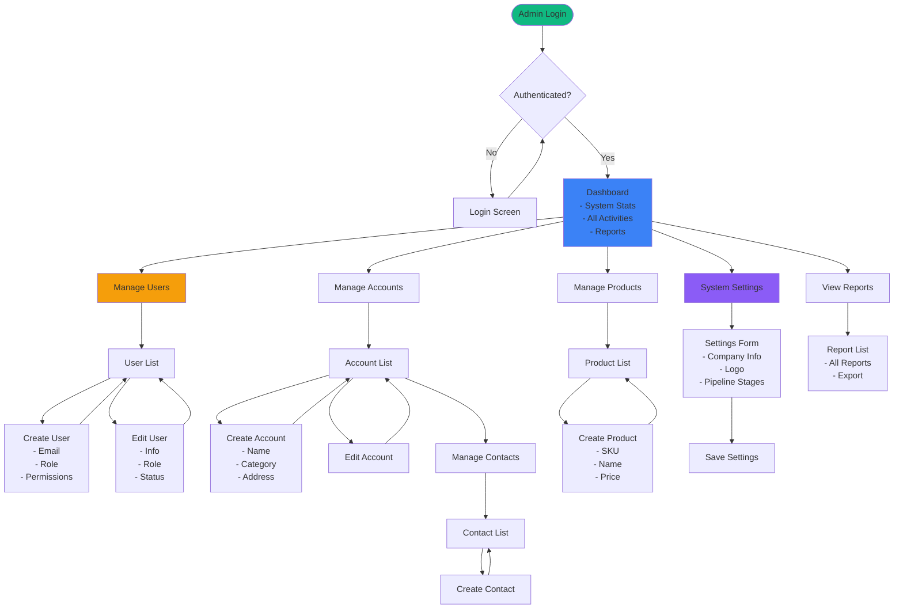
```mermaid
flowchart TD
    START([Admin Login]) --> AUTH{Authenticated?}
    AUTH -->|No| LOGIN[Login Screen]
    LOGIN --> AUTH
    AUTH -->|Yes| DASHBOARD[Dashboard<br/>- System Stats<br/>- All Activities<br/>- Reports]

    DASHBOARD --> MANAGE_USERS[Manage Users]
    DASHBOARD --> MANAGE_ACCOUNTS[Manage Accounts]
    DASHBOARD --> MANAGE_PRODUCTS[Manage Products]
    DASHBOARD --> SYSTEM_SETTINGS[System Settings]
    DASHBOARD --> VIEW_REPORTS[View Reports]

    MANAGE_USERS --> USER_LIST[User List]
    USER_LIST --> CREATE_USER[Create User<br/>- Email<br/>- Role<br/>- Permissions]
    USER_LIST --> EDIT_USER[Edit User<br/>- Info<br/>- Role<br/>- Status]
    CREATE_USER --> USER_LIST
    EDIT_USER --> USER_LIST

    MANAGE_ACCOUNTS --> ACCOUNT_LIST[Account List]
    ACCOUNT_LIST --> CREATE_ACCOUNT[Create Account<br/>- Name<br/>- Category<br/>- Address]
    ACCOUNT_LIST --> EDIT_ACCOUNT[Edit Account]
    ACCOUNT_LIST --> MANAGE_CONTACTS[Manage Contacts]
    CREATE_ACCOUNT --> ACCOUNT_LIST
    EDIT_ACCOUNT --> ACCOUNT_LIST
    MANAGE_CONTACTS --> CONTACT_LIST[Contact List]
    CONTACT_LIST --> CREATE_CONTACT[Create Contact]
    CREATE_CONTACT --> CONTACT_LIST

    MANAGE_PRODUCTS --> PRODUCT_LIST[Product List]
    PRODUCT_LIST --> CREATE_PRODUCT[Create Product<br/>- SKU<br/>- Name<br/>- Price]
    CREATE_PRODUCT --> PRODUCT_LIST

    SYSTEM_SETTINGS --> SETTINGS_FORM[Settings Form<br/>- Company Info<br/>- Logo<br/>- Pipeline Stages]
    SETTINGS_FORM --> SAVE[Save Settings]

    VIEW_REPORTS --> REPORT_LIST[Report List<br/>- All Reports<br/>- Export]

    style START fill:#10b981
    style DASHBOARD fill:#3b82f6
    style MANAGE_USERS fill:#f59e0b
    style SYSTEM_SETTINGS fill:#8b5cf6
```

---

## Input/Output Diagrams

### 1. Account & Contact Management - I/O

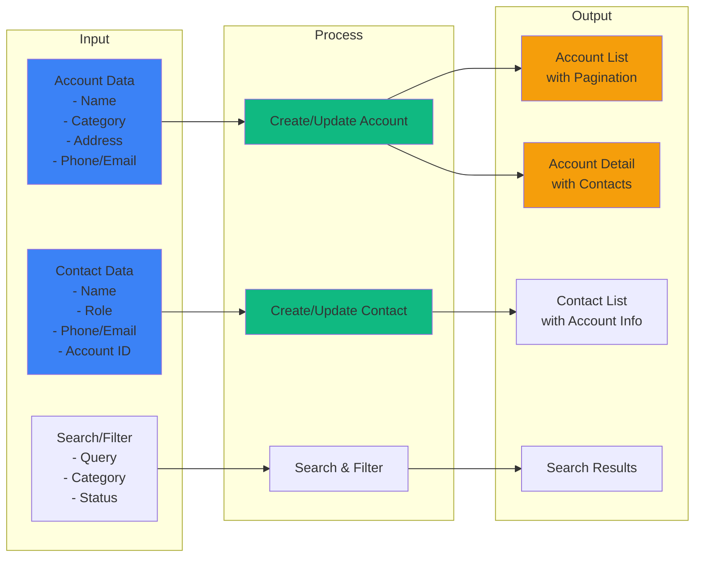
```mermaid
graph LR
    subgraph "Input"
        I1[Account Data<br/>- Name<br/>- Category<br/>- Address<br/>- Phone/Email]
        I2[Contact Data<br/>- Name<br/>- Role<br/>- Phone/Email<br/>- Account ID]
        I3[Search/Filter<br/>- Query<br/>- Category<br/>- Status]
    end

    subgraph "Process"
        P1[Create/Update Account]
        P2[Create/Update Contact]
        P3[Search & Filter]
    end

    subgraph "Output"
        O1[Account List<br/>with Pagination]
        O2[Account Detail<br/>with Contacts]
        O3[Contact List<br/>with Account Info]
        O4[Search Results]
    end

    I1 --> P1
    I2 --> P2
    I3 --> P3

    P1 --> O1
    P1 --> O2
    P2 --> O3
    P3 --> O4

    style I1 fill:#3b82f6
    style I2 fill:#3b82f6
    style P1 fill:#10b981
    style P2 fill:#10b981
    style O1 fill:#f59e0b
    style O2 fill:#f59e0b
```

### 2. Visit Report - I/O

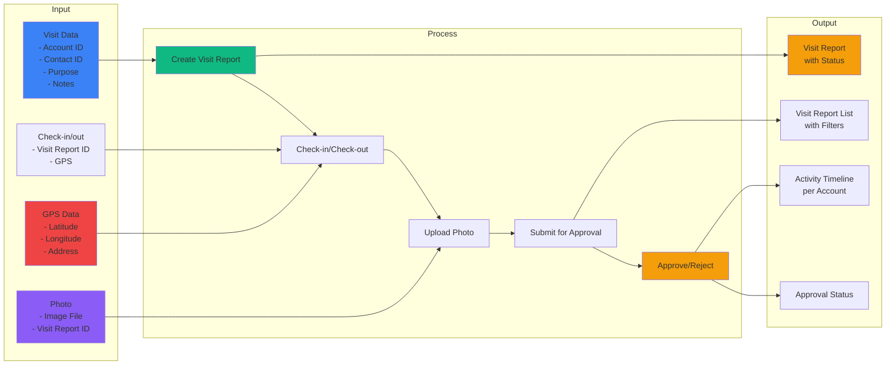
```mermaid
graph LR
    subgraph "Input"
        I1[Visit Data<br/>- Account ID<br/>- Contact ID<br/>- Purpose<br/>- Notes]
        I2[GPS Data<br/>- Latitude<br/>- Longitude<br/>- Address]
        I3[Photo<br/>- Image File<br/>- Visit Report ID]
        I4[Check-in/out<br/>- Visit Report ID<br/>- GPS]
    end

    subgraph "Process"
        P1[Create Visit Report]
        P2[Check-in/Check-out]
        P3[Upload Photo]
        P4[Submit for Approval]
        P5[Approve/Reject]
    end

    subgraph "Output"
        O1[Visit Report<br/>with Status]
        O2[Visit Report List<br/>with Filters]
        O3[Activity Timeline<br/>per Account]
        O4[Approval Status]
    end

    I1 --> P1
    I2 --> P2
    I3 --> P3
    I4 --> P2

    P1 --> P2
    P2 --> P3
    P3 --> P4
    P4 --> P5

    P1 --> O1
    P4 --> O2
    P5 --> O3
    P5 --> O4

    style I1 fill:#3b82f6
    style I2 fill:#ef4444
    style I3 fill:#8b5cf6
    style P1 fill:#10b981
    style P5 fill:#f59e0b
    style O1 fill:#f59e0b
```

### 3. Sales Pipeline - I/O

```mermaid
graph LR
    subgraph "Input"
        I1[Deal Data<br/>- Account ID (from Lead Conversion)<br/>- Contact ID (from Lead Conversion)<br/>- Title<br/>- Value<br/>- Stage ID<br/>- Lead ID (source)]
        I2[Move Deal<br/>- Deal ID<br/>- New Stage ID]
        I3[Filter<br/>- Stage<br/>- Account<br/>- Date Range]
        I4[Lead Conversion<br/>- Lead ID<br/>- Opportunity Title<br/>- Stage ID<br/>- Value<br/>- Create Account/Contact]
    end

    subgraph "Process"
        P1[Convert Lead to Deal]
        P2[Create Deal (from Lead)]
        P3[Move Deal to Stage]
        P4[Update Deal]
        P5[Calculate Forecast]
    end

    subgraph "Output"
        O1[Pipeline View<br/>Kanban by Stage]
        O2[Deal Detail<br/>with History]
        O3[Pipeline Summary<br/>- Total Value<br/>- By Stage<br/>- Forecast]
        O4[Deal List<br/>with Filters]
    end

    I1 --> P2
    I2 --> P3
    I3 --> P5
    I4 --> P1

    P1 --> P2
    P2 --> P5
    P3 --> P5
    P4 --> P5

    P1 --> O1
    P2 --> O1
    P3 --> O1
    P5 --> O3
    P2 --> O2

    style I1 fill:#3b82f6
    style P1 fill:#10b981
    style P4 fill:#f59e0b
    style O1 fill:#8b5cf6
    style O3 fill:#ef4444
```

### 4. Task & Reminder - I/O

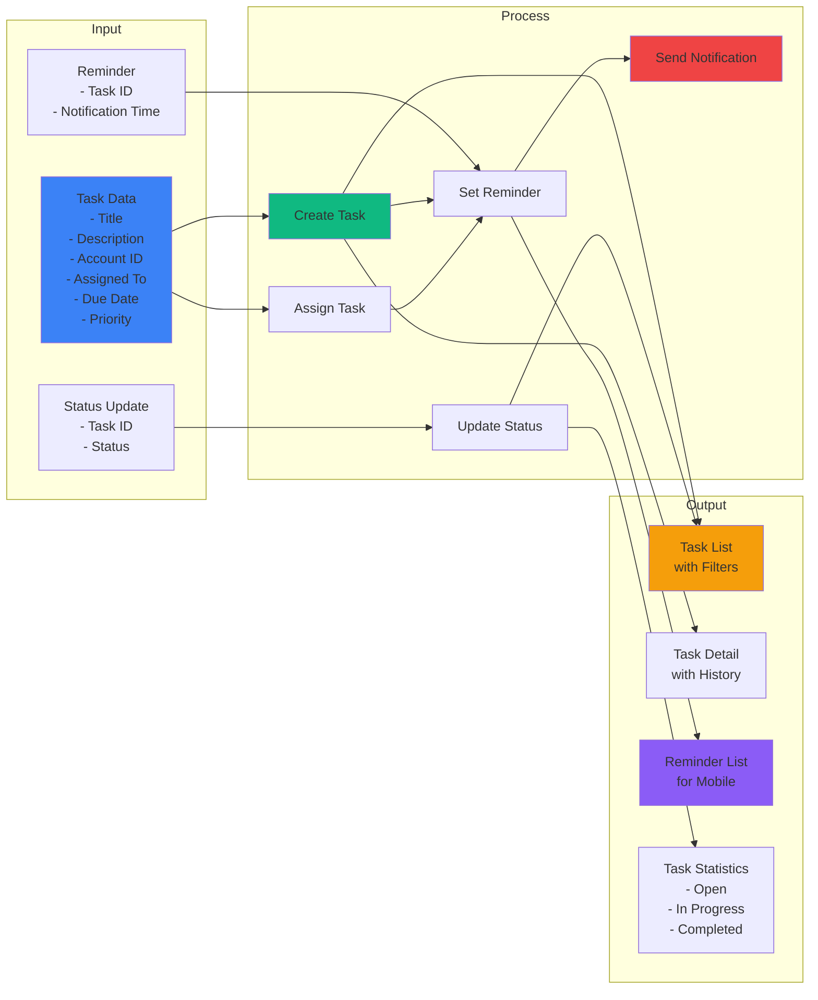
```mermaid
graph LR
    subgraph "Input"
        I1[Task Data<br/>- Title<br/>- Description<br/>- Account ID<br/>- Assigned To<br/>- Due Date<br/>- Priority]
        I2[Reminder<br/>- Task ID<br/>- Notification Time]
        I3[Status Update<br/>- Task ID<br/>- Status]
    end

    subgraph "Process"
        P1[Create Task]
        P2[Assign Task]
        P3[Update Status]
        P4[Set Reminder]
        P5[Send Notification]
    end

    subgraph "Output"
        O1[Task List<br/>with Filters]
        O2[Task Detail<br/>with History]
        O3[Reminder List<br/>for Mobile]
        O4[Task Statistics<br/>- Open<br/>- In Progress<br/>- Completed]
    end

    I1 --> P1
    I1 --> P2
    I2 --> P4
    I3 --> P3

    P1 --> P4
    P4 --> P5
    P2 --> P4

    P1 --> O1
    P3 --> O1
    P4 --> O3
    P1 --> O2
    P3 --> O4

    style I1 fill:#3b82f6
    style P1 fill:#10b981
    style P5 fill:#ef4444
    style O1 fill:#f59e0b
    style O3 fill:#8b5cf6
```

### 5. Dashboard - I/O

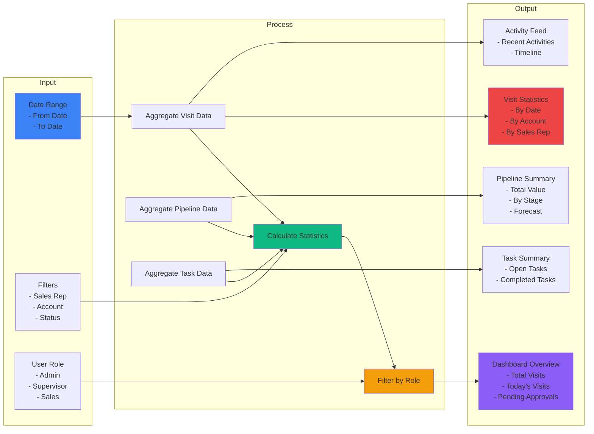
```mermaid
graph LR
    subgraph "Input"
        I1[Date Range<br/>- From Date<br/>- To Date]
        I2[Filters<br/>- Sales Rep<br/>- Account<br/>- Status]
        I3[User Role<br/>- Admin<br/>- Supervisor<br/>- Sales]
    end

    subgraph "Process"
        P1[Aggregate Visit Data]
        P2[Aggregate Pipeline Data]
        P3[Aggregate Task Data]
        P4[Calculate Statistics]
        P5[Filter by Role]
    end

    subgraph "Output"
        O1[Dashboard Overview<br/>- Total Visits<br/>- Today's Visits<br/>- Pending Approvals]
        O2[Visit Statistics<br/>- By Date<br/>- By Account<br/>- By Sales Rep]
        O3[Pipeline Summary<br/>- Total Value<br/>- By Stage<br/>- Forecast]
        O4[Activity Feed<br/>- Recent Activities<br/>- Timeline]
        O5[Task Summary<br/>- Open Tasks<br/>- Completed Tasks]
    end

    I1 --> P1
    I2 --> P4
    I3 --> P5

    P1 --> P4
    P2 --> P4
    P3 --> P4
    P4 --> P5

    P5 --> O1
    P1 --> O2
    P2 --> O3
    P1 --> O4
    P3 --> O5

    style I1 fill:#3b82f6
    style P4 fill:#10b981
    style P5 fill:#f59e0b
    style O1 fill:#8b5cf6
    style O2 fill:#ef4444
```

---

## System Architecture Diagram

### High-Level Architecture

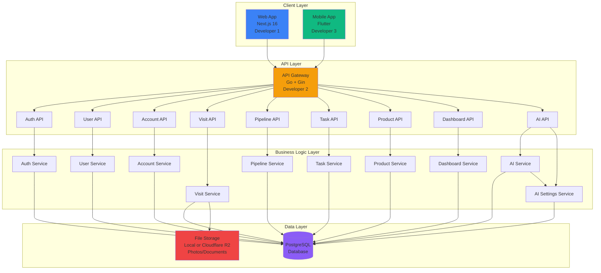
```mermaid
graph TB
    subgraph "Client Layer"
        WEB_APP[Web App<br/>Next.js 16<br/>Developer 1]
        MOBILE_APP[Mobile App<br/>Flutter<br/>Developer 3]
    end

    subgraph "API Layer"
        API_GATEWAY[API Gateway<br/>Go + Gin<br/>Developer 2]
        AUTH_API[Auth API]
        USER_API[User API]
        ACCOUNT_API[Account API]
        VISIT_API[Visit API]
        PIPELINE_API[Pipeline API]
        TASK_API[Task API]
        PRODUCT_API[Product API]
        DASHBOARD_API[Dashboard API]
        AI_API[AI API]
    end

    subgraph "Business Logic Layer"
        AUTH_SVC[Auth Service]
        USER_SVC[User Service]
        ACCOUNT_SVC[Account Service]
        VISIT_SVC[Visit Service]
        PIPELINE_SVC[Pipeline Service]
        TASK_SVC[Task Service]
        PRODUCT_SVC[Product Service]
        DASHBOARD_SVC[Dashboard Service]
        AI_SVC[AI Service]
        AI_SETTINGS_SVC[AI Settings Service]
    end

    subgraph "Data Layer"
        DB[(PostgreSQL<br/>Database)]
        FILE_STORAGE[File Storage<br/>Local or Cloudflare R2<br/>Photos/Documents]
    end

    WEB_APP --> API_GATEWAY
    MOBILE_APP --> API_GATEWAY

    API_GATEWAY --> AUTH_API
    API_GATEWAY --> USER_API
    API_GATEWAY --> ACCOUNT_API
    API_GATEWAY --> VISIT_API
    API_GATEWAY --> PIPELINE_API
    API_GATEWAY --> TASK_API
    API_GATEWAY --> PRODUCT_API
    API_GATEWAY --> DASHBOARD_API
    API_GATEWAY --> AI_API

    AUTH_API --> AUTH_SVC
    USER_API --> USER_SVC
    ACCOUNT_API --> ACCOUNT_SVC
    VISIT_API --> VISIT_SVC
    PIPELINE_API --> PIPELINE_SVC
    TASK_API --> TASK_SVC
    PRODUCT_API --> PRODUCT_SVC
    DASHBOARD_API --> DASHBOARD_SVC
    AI_API --> AI_SVC
    AI_API --> AI_SETTINGS_SVC

    AUTH_SVC --> DB
    USER_SVC --> DB
    ACCOUNT_SVC --> DB
    VISIT_SVC --> DB
    VISIT_SVC --> FILE_STORAGE
    PIPELINE_SVC --> DB
    TASK_SVC --> DB
    PRODUCT_SVC --> DB
    DASHBOARD_SVC --> DB
    AI_SVC --> DB
    AI_SETTINGS_SVC --> DB
    AI_SVC --> AI_SETTINGS_SVC

    style WEB_APP fill:#3b82f6
    style MOBILE_APP fill:#10b981
    style API_GATEWAY fill:#f59e0b
    style DB fill:#8b5cf6
    style FILE_STORAGE fill:#ef4444
```

### Data Flow Diagram

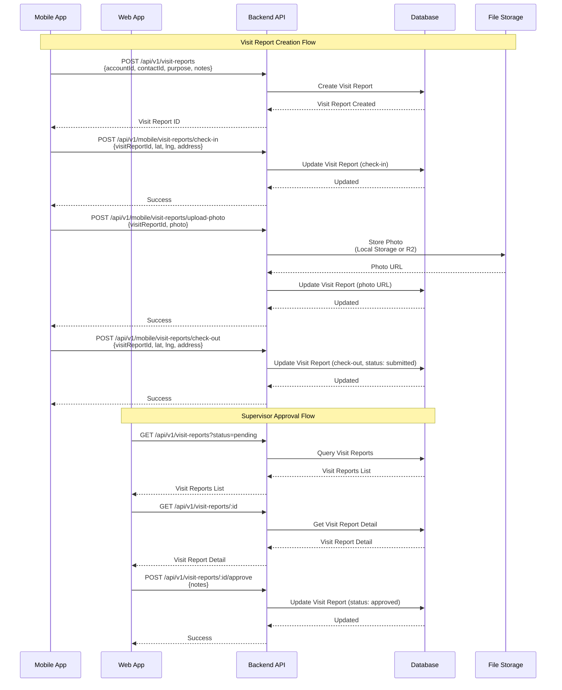
```mermaid
sequenceDiagram
    participant M as Mobile App
    participant W as Web App
    participant API as Backend API
    participant DB as Database
    participant FS as File Storage

    Note over M,FS: Visit Report Creation Flow

    M->>API: POST /api/v1/visit-reports<br/>{accountId, contactId, purpose, notes}
    API->>DB: Create Visit Report
    DB-->>API: Visit Report Created
    API-->>M: Visit Report ID

    M->>API: POST /api/v1/mobile/visit-reports/check-in<br/>{visitReportId, lat, lng, address}
    API->>DB: Update Visit Report (check-in)
    DB-->>API: Updated
    API-->>M: Success

    M->>API: POST /api/v1/mobile/visit-reports/upload-photo<br/>{visitReportId, photo}
    API->>FS: Store Photo<br/>(Local Storage or R2)
    FS-->>API: Photo URL
    API->>DB: Update Visit Report (photo URL)
    DB-->>API: Updated
    API-->>M: Success

    M->>API: POST /api/v1/mobile/visit-reports/check-out<br/>{visitReportId, lat, lng, address}
    API->>DB: Update Visit Report (check-out, status: submitted)
    DB-->>API: Updated
    API-->>M: Success

    Note over W,DB: Supervisor Approval Flow

    W->>API: GET /api/v1/visit-reports?status=pending
    API->>DB: Query Visit Reports
    DB-->>API: Visit Reports List
    API-->>W: Visit Reports List

    W->>API: GET /api/v1/visit-reports/:id
    API->>DB: Get Visit Report Detail
    DB-->>API: Visit Report Detail
    API-->>W: Visit Report Detail

    W->>API: POST /api/v1/visit-reports/:id/approve<br/>{notes}
    API->>DB: Update Visit Report (status: approved)
    DB-->>API: Updated
    API-->>W: Success
```

### Storage Architecture

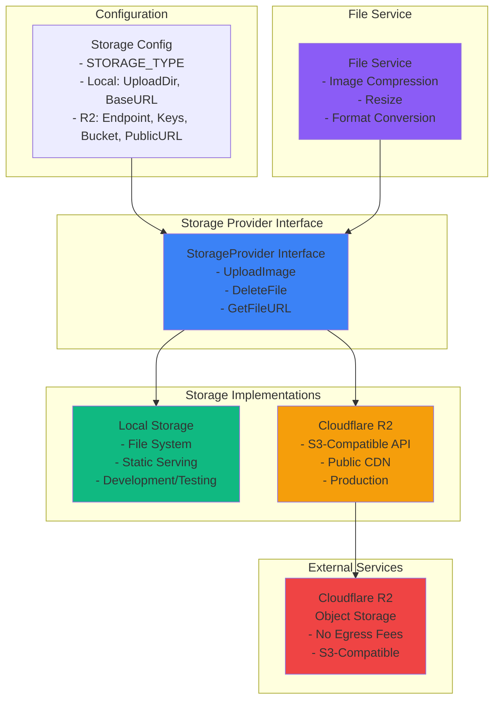
```mermaid
graph TB
    subgraph "Storage Provider Interface"
        STORAGE_IFACE[StorageProvider Interface<br/>- UploadImage<br/>- DeleteFile<br/>- GetFileURL]
    end

    subgraph "Storage Implementations"
        LOCAL_STORAGE[Local Storage<br/>- File System<br/>- Static Serving<br/>- Development/Testing]
        R2_STORAGE[Cloudflare R2<br/>- S3-Compatible API<br/>- Public CDN<br/>- Production]
    end

    subgraph "File Service"
        FILE_SVC[File Service<br/>- Image Compression<br/>- Resize<br/>- Format Conversion]
    end

    subgraph "Configuration"
        CONFIG[Storage Config<br/>- STORAGE_TYPE<br/>- Local: UploadDir, BaseURL<br/>- R2: Endpoint, Keys, Bucket, PublicURL]
    end

    subgraph "External Services"
        R2_CLOUDFLARE[Cloudflare R2<br/>Object Storage<br/>- No Egress Fees<br/>- S3-Compatible]
    end

    CONFIG --> STORAGE_IFACE
    STORAGE_IFACE --> LOCAL_STORAGE
    STORAGE_IFACE --> R2_STORAGE
    FILE_SVC --> STORAGE_IFACE
    R2_STORAGE --> R2_CLOUDFLARE

    style STORAGE_IFACE fill:#3b82f6
    style LOCAL_STORAGE fill:#10b981
    style R2_STORAGE fill:#f59e0b
    style FILE_SVC fill:#8b5cf6
    style R2_CLOUDFLARE fill:#ef4444
```

### File Upload Flow (with Storage Abstraction)

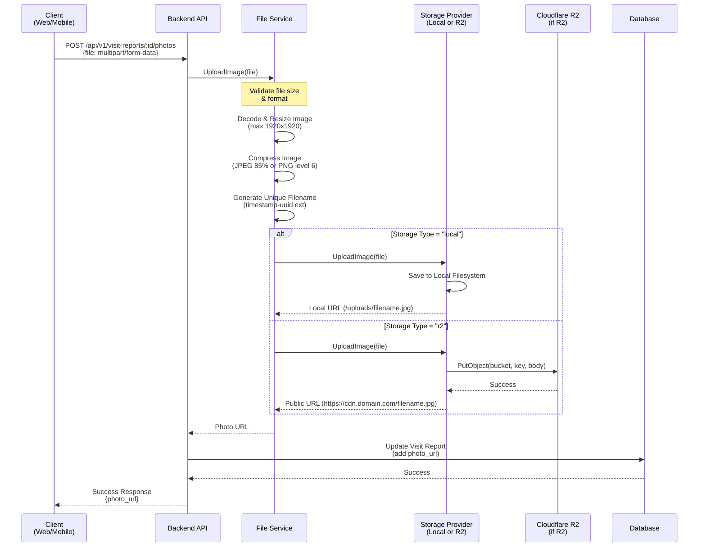
```mermaid
sequenceDiagram
    participant CLIENT as Client<br/>(Web/Mobile)
    participant API as Backend API
    participant FILE_SVC as File Service
    participant STORAGE as Storage Provider<br/>(Local or R2)
    participant R2 as Cloudflare R2<br/>(if R2)
    participant DB as Database

    CLIENT->>API: POST /api/v1/visit-reports/:id/photos<br/>{file: multipart/form-data}
    API->>FILE_SVC: UploadImage(file)

    Note over FILE_SVC: Validate file size<br/>& format

    FILE_SVC->>FILE_SVC: Decode & Resize Image<br/>(max 1920x1920)
    FILE_SVC->>FILE_SVC: Compress Image<br/>(JPEG 85% or PNG level 6)
    FILE_SVC->>FILE_SVC: Generate Unique Filename<br/>(timestamp-uuid.ext)

    alt Storage Type = "local"
        FILE_SVC->>STORAGE: UploadImage(file)
        STORAGE->>STORAGE: Save to Local Filesystem
        STORAGE-->>FILE_SVC: Local URL (/uploads/filename.jpg)
    else Storage Type = "r2"
        FILE_SVC->>STORAGE: UploadImage(file)
        STORAGE->>R2: PutObject(bucket, key, body)
        R2-->>STORAGE: Success
        STORAGE-->>FILE_SVC: Public URL (https://cdn.domain.com/filename.jpg)
    end

    FILE_SVC-->>API: Photo URL
    API->>DB: Update Visit Report<br/>(add photo_url)
    DB-->>API: Success
    API-->>CLIENT: Success Response<br/>{photo_url}
```

---

## Developer Responsibilities Matrix

### Developer 1: Web Developer

**Responsibilities:**

- ✅ Web UI/UX Development (Next.js 16)
- ✅ Frontend State Management (Zustand)
- ✅ Component Development (shadcn/ui v4)
- ✅ Integration with Backend APIs
- ✅ Form Validation (React Hook Form + Zod)
- ✅ Responsive Design (Tailwind CSS v4)

**Key Features:**

- **For All Roles:**
  - Account & Contact Management UI (CRUD)
  - Visit Report Creation & Management UI
  - Task Management UI
  - Dashboard UI
- **For Admin:**
  - User Management UI
  - System Settings UI
  - Full Reports UI
- **For Supervisor:**
  - Visit Report Review & Approval UI
  - Sales Pipeline Management UI
  - Team Reports UI
- **For Sales Rep:**
  - Visit Report Creation UI
  - Sales Pipeline View (Own Deals)
  - Own Reports View
  - AI Chatbot UI
  - AI Settings UI

### Developer 2: Backend Developer

**Responsibilities:**

- ✅ Backend API Development (Go + Gin)
- ✅ Database Design & Migration
- ✅ Business Logic Implementation
- ✅ Authentication & Authorization
- ✅ File Upload Handling
- ✅ API Documentation (Postman)

**Key Features:**

- All REST APIs
- Database Models & Migrations
- Authentication Service
- File Storage Service
  - Storage Provider Interface (Local/R2 abstraction)
  - Local Storage Implementation
  - Cloudflare R2 Storage Implementation
  - Image Compression & Resize
- AI Service (Cerebras/OpenAI/Anthropic)
- AI Settings & Privacy Management
- Data Validation
- Error Handling

### Developer 3: Mobile Developer

**Responsibilities:**

- ✅ Flutter Mobile App Development
- ✅ Mobile UI/UX
- ✅ GPS Integration
- ✅ Camera Integration
- ✅ Push Notifications
- ✅ Offline Support (Future)

**Key Features:**

- Account & Contact View
- Visit Report Creation with GPS & Camera
- Task Management
- Dashboard (Basic)
- Check-in/Check-out
- Photo Upload
- AI Chatbot (Future - if backend supports)

---

## Feature Priority Matrix

### MVP (Must Have)

| Feature                      | Priority  | Developer 1 | Developer 2 | Developer 3 |
| ---------------------------- | --------- | ----------- | ----------- | ----------- |
| Authentication               | 🔴 High   | ✅          | ✅          | ✅          |
| Account & Contact Management | 🔴 High   | ✅          | ✅          | ✅          |
| Visit Report (Create)        | 🔴 High   | ✅          | ✅          | ✅          |
| Visit Report (Approve)       | 🔴 High   | ✅          | ✅          | ❌          |
| Sales Pipeline               | 🟡 Medium | ✅          | ✅          | ❌          |
| Task & Reminder              | 🟡 Medium | ✅          | ✅          | ✅          |
| Dashboard                    | 🟡 Medium | ✅          | ✅          | ✅          |
| AI Assistant                 | 🟡 Medium | ✅          | ✅          | ❌          |
| Product Management           | 🟢 Low    | ✅          | ✅          | ❌          |

### Legend

- 🔴 High: Critical for MVP
- 🟡 Medium: Important but can be simplified
- 🟢 Low: Nice to have, can be deferred

---

## Summary

### Project Scope

- **Platform**: Web (Next.js 16) + Mobile (Flutter) + Backend (Go)
- **Users**: Sales Rep, Supervisor, Admin
- **Core Features**: 9 modules (Auth, Users, Accounts, Visits, Pipeline, Tasks, Products, Dashboard, AI Assistant)

### Key User Flows

1. **Sales Rep (Web)**:
   - Login → Dashboard → Manage Leads → Convert Lead to Deal → Manage Accounts/Contacts → Create Visit Report (Lead/Deal/Account) → View Pipeline → Manage Tasks
2. **Sales Rep (Mobile)**:
   - Login → Dashboard → Create Visit Report (Lead/Deal/Account) → Check-in (GPS) → Fill Form → Upload Photo → Check-out (GPS) → View Tasks
3. **Supervisor (Web)**:
   - Login → Dashboard → Review Visit Reports → Approve/Reject → View Pipeline → Manage Tasks → View Reports → Lead Analytics
4. **Admin (Web)**:
   - Login → Dashboard → Manage Users → Manage Leads → Manage Accounts → Manage Products → System Settings → View All Reports

### Developer Focus

- **Developer 1**: Web UI/UX, Frontend Logic, Component Development
- **Developer 2**: Backend APIs, Database, Business Logic
- **Developer 3**: Mobile App, GPS/Camera Integration, Mobile UX

---

---

## Storage System

### Storage Types

1. **Local Storage** (Default)
   - Stores files in local filesystem
   - Served via static file serving
   - Best for: Development, Testing, Small deployments
   - Configuration: `STORAGE_TYPE=local`

2. **Cloudflare R2** (Production)
   - S3-compatible object storage
   - No egress fees
   - Public CDN access
   - Best for: Production, Scalability, Global distribution
   - Configuration: `STORAGE_TYPE=r2`

### Storage Features

- **Image Processing**: Automatic compression and resize (max 1920x1920)
- **Format Support**: JPEG, PNG (auto-convert to optimal format)
- **Unique Filenames**: Timestamp + UUID for collision prevention
- **Storage Abstraction**: Easy switch between Local and R2
- **Public URLs**: Automatic URL generation for uploaded files

### Configuration

**Local Storage:**

```env
STORAGE_TYPE=local
STORAGE_UPLOAD_DIR=/app/uploads
STORAGE_BASE_URL=/uploads
```

**Cloudflare R2:**

```env
STORAGE_TYPE=r2
R2_ENDPOINT=https://<account-id>.r2.cloudflarestorage.com
R2_ACCESS_KEY_ID=<access-key>
R2_SECRET_ACCESS_KEY=<secret-key>
R2_BUCKET=<bucket-name>
R2_PUBLIC_URL=https://cdn.yourdomain.com
```

For detailed setup instructions, see [apps/api/STORAGE_SETUP.md](../../apps/api/STORAGE_SETUP.md)

---

**Last Updated**: 2025-12-07  
**Maintained By**: Development Team
